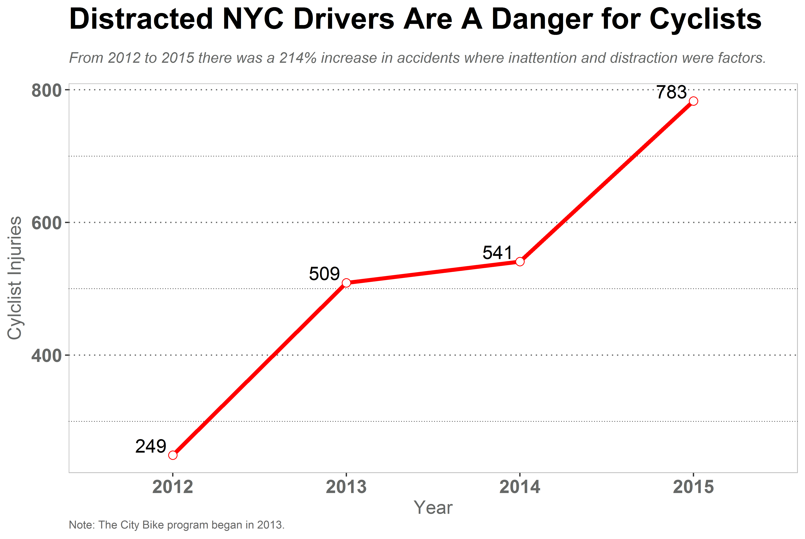

class: center, middle, inverse
background-image: url(http://m40z.com/images/biker-in-new-york-bell-big.jpg)

# A Survey of Bicycle Accidents in NYC
## 2012-2015

```{r setup, include=FALSE}
options(htmltools.dir.version = FALSE)
```
---

class: inverse, center, middle

# A Quick Overview

---

# Fast Facts

--

*  __Brooklyn__ and __Manhattan__ have the highest number of bicycle accidents.

--

*  __Staten Island__ has the fewest.

--

*  There is a strong indication of __seasonality__ (ie, winter months have fewer accidents).

--

*  __Driver distraction__ is increasingly a risk for NYC cyclists.

---

```{r, echo=FALSE}

```

---

```{r, echo=FALSE}
knitr::include_graphics("images/heatmap2.png")
```
---
class: center, middle
```{r, echo=FALSE}

```
---
class: inverse, center, middle

# Contributing Factors to Bike Accidents

---
class: center, middle
# Top 5 Factors

```{r, echo=FALSE}

```
---
class: inverse, center, middle

# Let's Examine Driver Inattention/Distraction More Closely

```{r, echo=FALSE}
knitr::include_graphics("https://media.giphy.com/media/Ji1vheXQqZCqA/giphy.gif")
```
---

```{r, echo=FALSE}

```
---

```{r, echo=FALSE}

```
---
class: center, middle

# Types of Vehicles Most Often Involved with Driver Inattention/Distraction

```{r, echo=FALSE}

```
---
class: inverse, center, middle

#About the data set

---


```{r, echo=FALSE}

```

*  Data is available via __data.cityofnewyork.us__
*  You can go directly to the data [here.](https://data.cityofnewyork.us/Public-Safety/NYPD-Motor-Vehicle-Collisions/h9gi-nx95/data)
*  About 900k Observations
*  Available in many different formats (eg, csv, json, xml)
---
class: inverse, center, middle
#Code
---
class: center, middle
### Code: (https://github.com/matthewcurrier/ncoe-pres)

---

# Summary

*  Most accidents occur in the __afternoon and evening__ during the summer months.
*  __Passenger vehicles__ are most often involved with driver inattention / distraction incidents.
*  Because Brooklyn leads in accidents, Safety efforts might want to target __Brooklyn first__.
*  It would be interesting to explore driver inattention / distraction more closely.
   +  ie, What _exactly_ is involved in driver inattention / distraction?
*  Additional exercises might include __mapping accidents__. (The data set includes geo cooridnates.)
*  We could enrich this data set by __adding census data__.
   + This would give us an idea if certain zip codes have a higher rate of accidents controlling for population.

---
#About the Presenter

.pull-left[
Matthew Currier is a seasoned analytics professional who is passionate about finding the __answers to questions__, __programming__, and __visualizing information__.


*  MBA in Computer Information Systems and Statistics
*  Industry experience includes tech, publishing, health care, and education.
*  Experience managing analytics teams, coding, offshore development teams, and articulating strategic initiatives.
]

.pull-right[

```{r, echo=FALSE}

```
]

---
class: inverse, center, middle
#The End


